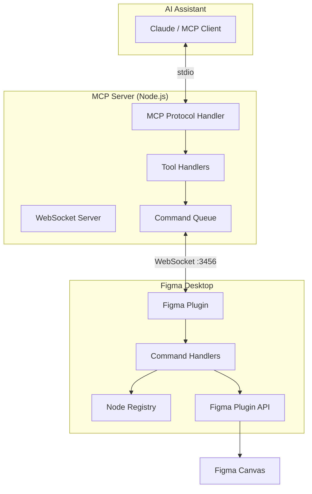
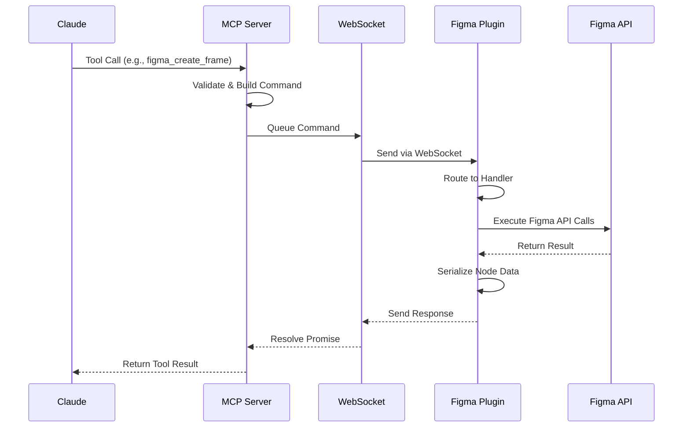
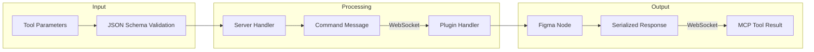
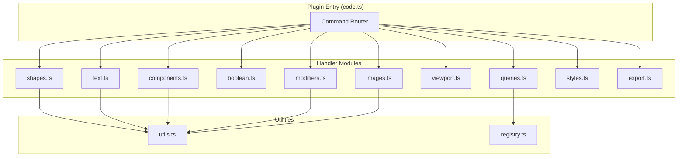

# Figma MCP Bridge

A Model Context Protocol (MCP) server and Figma plugin that enables AI assistants like Claude to create and manipulate designs directly in Figma.

## Overview

Figma MCP Bridge provides a bridge between AI assistants and the Figma design tool, allowing programmatic creation and manipulation of UI designs, components, and design systems.

## Architecture

### System Overview



### Communication Flow



### Data Flow



### Plugin Handler Architecture



## Features

- **50+ Figma Tools** - Comprehensive coverage of Figma's Plugin API
- **Real-time Communication** - WebSocket connection for instant updates
- **Design System Support** - Create and manage components, styles, and variables
- **Full Node Control** - Create, modify, query, and export any Figma element

## Quick Start

### Prerequisites

- Node.js >= 18.0.0
- Figma Desktop application
- Claude Desktop or another MCP-compatible AI assistant

### Installation

```bash
# Clone the repository
git clone https://github.com/your-username/figma-mcp-bridge.git
cd figma-mcp-bridge

# Install dependencies
npm install

# Build the project
npm run build
```

### Configure Claude Desktop

Add to your Claude Desktop config (`~/Library/Application Support/Claude/claude_desktop_config.json`):

```json
{
  "mcpServers": {
    "figma-bridge": {
      "command": "node",
      "args": ["/path/to/figma-mcp-bridge/dist/server/index.js"]
    }
  }
}
```

### Install the Figma Plugin

1. Open Figma Desktop
2. Go to **Plugins → Development → Import plugin from manifest**
3. Select `dist/plugin/manifest.json`
4. Run the plugin from the Plugins menu

The plugin will connect via WebSocket to the MCP server and display a connection status indicator.

## Available Tools

### Shape Creation
| Tool | Description |
|------|-------------|
| `figma_create_frame` | Create container frames with auto-layout support |
| `figma_create_rectangle` | Create rectangles with optional corner radius |
| `figma_create_ellipse` | Create ellipses, circles, and arcs |
| `figma_create_polygon` | Create regular polygons (triangles, hexagons, etc.) |
| `figma_create_star` | Create star shapes with configurable points |
| `figma_create_line` | Create lines and dividers |
| `figma_create_vector` | Create custom vector shapes from SVG paths |
| `figma_create_from_svg` | Import complete SVG files |
| `figma_create_section` | Create organizational sections |
| `figma_create_slice` | Create export region slices |

### Text
| Tool | Description |
|------|-------------|
| `figma_create_text` | Create text elements with font/style options |
| `figma_set_text_range_style` | Apply mixed formatting within text |

### Components
| Tool | Description |
|------|-------------|
| `figma_create_component` | Create reusable component masters |
| `figma_create_instance` | Create instances of components |
| `figma_component_from_node` | Convert existing nodes to components |
| `figma_import_component` | Import components from libraries |

### Boolean Operations
| Tool | Description |
|------|-------------|
| `figma_boolean_union` | Combine shapes (add) |
| `figma_boolean_subtract` | Cut shapes out of base shape |
| `figma_boolean_intersect` | Keep only overlapping areas |
| `figma_boolean_exclude` | Remove overlapping areas (XOR) |
| `figma_flatten_node` | Flatten to single vector path |

### Grouping
| Tool | Description |
|------|-------------|
| `figma_group_nodes` | Group multiple nodes together |
| `figma_ungroup_node` | Break apart groups |

### Design Tokens & Styles
| Tool | Description |
|------|-------------|
| `figma_create_text_style` | Create reusable text styles |
| `figma_create_color_style` | Create reusable color/paint styles |
| `figma_create_effect_style` | Create reusable effect styles |
| `figma_create_variable_collection` | Create variable collections for design tokens |
| `figma_create_variable` | Create individual design token variables |

### Node Modification
| Tool | Description |
|------|-------------|
| `figma_update_node` | Update any node properties |
| `figma_move_node` | Reposition nodes on canvas |
| `figma_delete_node` | Remove nodes |
| `figma_clone_node` | Duplicate nodes |
| `figma_set_fills` | Set fill paints |
| `figma_set_strokes` | Set stroke paints and properties |
| `figma_set_effects` | Apply shadows and blurs |
| `figma_set_constraints` | Set resize behavior |
| `figma_set_layout` | Configure auto-layout |
| `figma_set_layout_grids` | Add alignment grids |
| `figma_set_blend_mode` | Set layer blending |
| `figma_set_gradient_fill` | Apply gradient fills |
| `figma_set_mask` | Configure masking |
| `figma_set_transform` | Set rotation/transform |
| `figma_set_image_fill` | Apply image fills |

### Images
| Tool | Description |
|------|-------------|
| `figma_create_image` | Upload images to Figma |
| `figma_get_image_data` | Get image data from nodes |
| `figma_set_image_fill` | Apply images as fills |

### Queries
| Tool | Description |
|------|-------------|
| `figma_get_selection` | Get currently selected nodes |
| `figma_get_page_nodes` | List all page contents |
| `figma_get_node_by_id` | Get node by Figma ID |
| `figma_get_node_by_name` | Find node by name |
| `figma_find_nodes` | Search nodes by criteria |
| `figma_get_styles` | List all document styles |
| `figma_get_components` | List all document components |
| `figma_get_variables` | List all variable collections |
| `figma_list_fonts` | List available fonts |

### Viewport & Selection
| Tool | Description |
|------|-------------|
| `figma_set_selection` | Programmatically select nodes |
| `figma_zoom_to_fit` | Pan/zoom to frame nodes |
| `figma_get_viewport` | Get current viewport state |
| `figma_set_viewport` | Set viewport position/zoom |

### Page Operations
| Tool | Description |
|------|-------------|
| `figma_create_page` | Create new pages |
| `figma_create_page_divider` | Create page list dividers |

### Export
| Tool | Description |
|------|-------------|
| `figma_export_node` | Export as PNG, JPG, SVG, PDF, or JSON |

### Status
| Tool | Description |
|------|-------------|
| `figma_status` | Check plugin connection status |

## Development

### Project Structure

```
figma-mcp-bridge/
├── server/                 # MCP server (TypeScript)
│   ├── index.ts           # Entry point
│   ├── mcp-server.ts      # MCP protocol handling
│   ├── websocket-server.ts # WebSocket server
│   └── tools/             # Tool handlers and metadata
│       ├── handlers/      # Individual tool implementations
│       ├── tool-metadata.ts
│       └── generated-schemas.ts
├── plugin/                 # Figma plugin (TypeScript)
│   ├── code.ts            # Plugin entry point
│   ├── handlers/          # Command handlers
│   ├── ui.html            # Plugin UI
│   └── manifest.json      # Plugin manifest
├── types/                  # Shared TypeScript types
│   ├── commands.ts        # Command type definitions
│   ├── data.ts           # Data payload types
│   └── messages.ts       # WebSocket message types
└── dist/                   # Build output
    ├── server/
    └── plugin/
```

### Build Commands

```bash
npm run build           # Build both server and plugin
npm run build:server    # Build server only
npm run build:plugin    # Build plugin only
npm run watch           # Watch mode for development
npm run generate:schemas # Regenerate JSON schemas from types
npm run lint            # Run ESLint
npm run lint:fix        # Fix linting issues
npm run clean           # Remove build artifacts
```

### TypeScript Configuration

The project uses separate TypeScript configurations:

- `tsconfig.base.json` - Shared compiler settings
- `tsconfig.server.json` - Server config (ES2022, ESM modules)
- `tsconfig.plugin.json` - Plugin config (ES6 target for Figma compatibility)

### Adding New Tools

1. Add the command type to `types/commands.ts`
2. Add the data type to `types/data.ts`
3. Create a handler in `server/tools/handlers/`
4. Add metadata to `server/tools/tool-metadata.ts`
5. Implement the plugin handler in `plugin/handlers/`
6. Run `npm run generate:schemas` to update JSON schemas
7. Rebuild with `npm run build`

## Technical Details

- **Server Port:** 3456 (HTTP + WebSocket)
- **Command Timeout:** 120 seconds
- **Plugin Types:** `@figma/plugin-typings`
- **MCP SDK:** `@modelcontextprotocol/sdk`

## License

MIT
